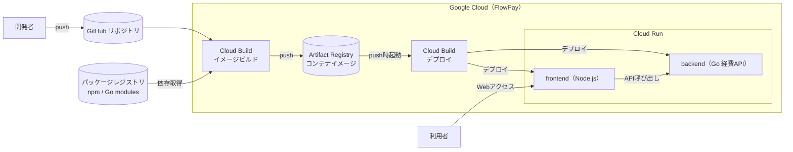

# 第1章 ソフトウェアサプライチェーンの構造的リスク

## 目次
- [第1章 ソフトウェアサプライチェーンの構造的リスク](#第1章-ソフトウェアサプライチェーンの構造的リスク)
  - [目次](#目次)
  - [はじめに](#はじめに)
  - [FlowPay の環境](#flowpay-の環境)
    - [演習環境の確認](#演習環境の確認)
  - [サプライチェーン攻撃とは](#サプライチェーン攻撃とは)
  - [ソフトウェアサプライチェーンとは](#ソフトウェアサプライチェーンとは)
  - [深刻化するサプライチェーン攻撃](#深刻化するサプライチェーン攻撃)
  - [1-1 インシデントから学ぶ](#1-1-インシデントから学ぶ)
    - [事例1 Shai-Hulud（自己増殖型ワーム）](#事例1-shai-hulud自己増殖型ワーム)
    - [事例2 axios（メンテナアカウントの奪取）](#事例2-axiosメンテナアカウントの奪取)
    - [事例3 TanStack（正当な署名を持つ悪性パッケージ）](#事例3-tanstack正当な署名を持つ悪性パッケージ)
    - [事例4 Trivy（セキュリティツール自身の侵害）](#事例4-trivyセキュリティツール自身の侵害)
    - [過去の代表的インシデント](#過去の代表的インシデント)
    - [事例の共通点](#事例の共通点)
  - [1-2 構造的リスクの整理](#1-2-構造的リスクの整理)
    - [サプライチェーンの全体像](#サプライチェーンの全体像)
    - [開発ライフサイクルにおける段階分割](#開発ライフサイクルにおける段階分割)
    - [コンテナ特有のリスク構造](#コンテナ特有のリスク構造)
    - [主要な攻撃手法](#主要な攻撃手法)
    - [人・プロセス・技術の 3軸による整理](#人プロセス技術の-3軸による整理)
    - [脆弱性と悪性コードの違い](#脆弱性と悪性コードの違い)
    - [防御を困難にする構造的要因](#防御を困難にする構造的要因)
  - [1-3 攻撃デモ](#1-3-攻撃デモ)

---

## はじめに

本講義では、架空の Fintech スタートアップ「株式会社 PayLoad」を題材とします。PayLoad 社は、法人向け経費精算プラットフォーム「FlowPay」を運営しており、コンテナ技術と OSS パッケージを活用して急成長を遂げてきました。しかし、大手金融機関との業務提携に伴い、従来後回しにされていたセキュリティおよびガバナンス体制の強化が急務となっています。

近年、npm や PyPI などの主要なパッケージレジストリへの悪性パッケージの混入や、CI/CD パイプラインの乗っ取りといったソフトウェアサプライチェーン攻撃が相次いで報じられ、社会的な注目が高まっています。提携先の金融機関からも、利用している OSS やビルド・配布経路の管理状況について説明を求められました。これを受けて経営層は、依存パッケージの取得からビルド・配布・デプロイに至る経路全体で自社のソフトウェアを保護すること、すなわちソフトウェアサプライチェーン対策を最優先の経営課題と位置づけました。あなたは、その推進を命じられた PayLoad 社のセキュリティ担当者です。

講義を通して、現代の開発・運用現場に潜むサプライチェーンの構造的リスクを体系的に把握し、限られたリソースの中で優先すべきセキュリティ対策を適切に判断する実行力を養います。

## FlowPay の環境

まず、担当する FlowPay のシステム構成を確認します。FlowPay は、GitHub から Cloud Build を経由してコンテナイメージをビルドし、Artifact Registry へ保存後、Cloud Run にデプロイして運用されるマイクロサービス構成を採用しています。フロントエンドは npm レジストリ上の OSS パッケージに依存する Node.js アプリケーション、バックエンドは Go 言語で実装された経費精算 API で構成されます。



実行時においては、エンドユーザーがフロントエンドサービスにアクセスし、フロントエンドがバックエンドサービスを ID トークン認証によって呼び出します。両サービスとも外部インターネットへ直接公開されない非公開（private）設定の Cloud Run 上で稼働します。

```
[ブラウザ] → frontend(Node.js) --ID token--> backend(Go, private) → 経費データ(インメモリ)
```

### 演習環境の確認

演習を始める前に、担当する FlowPay 環境が正常に稼働していること、および参加者自身のコード変更が CI/CD パイプラインを通じてデプロイされることを確認します。プロキシ経由での接続確認に加え、実際にコードを変更して push し、ビルド・デプロイが自動実行されて変更が反映される流れを体験します。

具体的な手順は [環境確認の手引き（environment-check.md）](environment-check.md) を参照してください。

## サプライチェーン攻撃とは

欧州連合サイバーセキュリティ機関（ENISA）は、サプライチェーン攻撃を「少なくとも 2つの攻撃の組み合わせ」として定義しています。一次ターゲットとなる供給元（サプライヤー）を最初に侵害し、そこを踏み台として本来の標的である顧客企業や関連組織へ到達する多段階の手法です。攻撃者は標的対象を直接攻撃せず、標的が信頼している外部供給経路を経由して侵入を試みます。その本質は、暗黙の信頼の連鎖を悪用した上流から下流への侵入にあります。

MITRE ATT&CK リポジトリにおいても、サプライチェーンの侵害（T1195）は初期侵入（Initial Access）の主要テクニックとして位置づけられています。攻撃者はここを足がかりとし、認証情報の窃取、横展開（ラテラルムーブメント）、永続化へと攻撃フェーズを進行させます。

サプライチェーン攻撃は侵害経路に応じて大きく 3つに分類されます。本講義の主要対象領域はソフトウェアサプライチェーン攻撃です。

- **ソフトウェアサプライチェーン攻撃**: 外部から取り込むソースコード、依存ライブラリ、CI/CD パイプラインツール、ビルド環境を改ざんし、製品やサービスを正規の配信経路で展開させる手法（SolarWinds、XZ Utils、axios などの事例）。自社のビルド・デプロイパイプラインそのものを乗っ取る Poisoned Pipeline Execution（PPE）も本領域に含まれます。
- **SaaS/サービスのサプライチェーン攻撃**: 稼働中の外部 SaaS や運用ベンダーの信頼（API キー、OAuth トークン、リモート管理権限等）を侵害し、顧客の環境へ不正侵入する手法。
- **ビジネス（事業）サプライチェーン攻撃**: 業務委託先、調達先パートナー、ハードウェアベンダー等、事業を支える取引先の連鎖を踏み台にする手法。

一方、ソフトウェアサプライチェーンセキュリティは供給網全体を保護する包括的な取り組みであり、以下の 2つの視点が存在します。

1. **供給元（プロバイダー）としての保護**: 自社成果物・製品の改ざんを防ぐ施策（デジタル署名、provenance の付与、ビルド環境の堅牢化）。
2. **利用側（コンシューマー）としての保護**: 導入する外部コンポーネントやツールのリスク管理（SBOM による構成部品の把握、脆弱性管理、VEX による評価）。

> 出典:
> - ENISA『Threat Landscape for Supply Chain Attacks』(2021年7月)
> - MITRE ATT&CK T1195 "Supply Chain Compromise"

## ソフトウェアサプライチェーンとは

ソフトウェアサプライチェーン対策は、既存の依存ライブラリに対する単なる脆弱性管理（SCA）と同義として捉えられることもありますが、実際にはより広範な概念を指します。

現代の開発運用におけるソフトウェアサプライチェーンとは、設計、開発、ビルド、テスト、パッケージング、配布、デプロイ、運用に至るまで、直接的または間接的に関わるすべての構成要素の連鎖を意味します。対象領域には以下が含まれます。

- **人**: 社内開発者、外部委託先エンジニア、システム管理者、OSS メンテナ
- **プロセス**: コードレビュー、承認、リリースフローを定めた運用ルール・ガイドライン
- **技術・インフラ**: 開発端末環境、CI/CD パイプライン、コンテナレジストリ、ビルドサーバー、配信インフラ

ソフトウェアサプライチェーンセキュリティとは、これら全構成要素の完全性、信頼性、回復力をソフトウェアの全ライフサイクルにわたって確保する取り組みです。

## 深刻化するサプライチェーン攻撃

ソフトウェアサプライチェーンを標的としたサイバー攻撃は爆発的に増加しています。特に集中標的となっているのが、コンポーネント供給拠点であるパッケージレジストリです。Sonatype の調査によると、2025年の 1年間で 40万件を超える悪性 OSS パッケージが新たに検知され、その 99% 以上が npm レジストリに集中していました。

攻撃者がパッケージレジストリを優先的に狙う理由は、単一の拠点を侵害することで多数の利用企業へ極めて効率的に被害を拡散できるためです。従来の境界防御（Perimeter Defense）を強固に構築しても、信頼された供給経路を介して侵入する攻撃を防ぐことはできません。

攻撃のスピードも極めて高速化しています。2025年前半に悪用された脆弱性の 32% が公開から 24時間以内に悪用され、初期侵入から組織内部での横展開に至る平均時間は 29分（最速記録は 27秒）と報告されています。

さらに、AI モデルや生成 AI の活用により未知の欠陥（ゼロデイ脆弱性）の発見が自動化・高速化されています。Google の AI エージェント Big Sleep は、SQLite で長年見落とされていた未知のゼロデイ脆弱性を自動発見・報告しました。攻撃者による脆弱性の兵器化（weaponization）までの時間が一層短縮される傾向にあります。

> 出典:
> - [Sonatype 2026 State of the Software Supply Chain](https://www.sonatype.com/state-of-the-software-supply-chain/2026/open-source-malware)
> - [VulnCheck State of Exploitation 1H-2025](https://www.vulncheck.com/blog/state-of-exploitation-1h-2025)
> - [CrowdStrike 2026 Global Threat Report](https://www.crowdstrike.com/en-us/blog/crowdstrike-2026-global-threat-report-findings/)
> - [Google Big Sleep が SQLite のゼロデイを発見（The Hacker News, 2024-11）](https://thehackernews.com/2024/11/googles-ai-tool-big-sleep-finds-zero.html)

---

## 1-1 インシデントから学ぶ

### 事例1 Shai-Hulud（自己増殖型ワーム）

2025年9月、npm エコシステムにおいて初となる自己増殖型ワーム「Shai-Hulud」が発見・確認されました。開発者の認証情報を窃取し、その権限を用いて自身が管理する他のパッケージへ悪意のあるコードを自動注入・再パブリッシュする動作を連鎖的に繰り返す仕組みです。

同年11月には高度化された第二波（Shai-Hulud 2.0）が発生し、約 800個のパッケージが汚染被害を受けました。この第二波では以下の高度な手口が用いられています。

- Node.js 標準の監視・検知を回避するため、JavaScript ランタイム Bun 環境上で動作
- ローカル環境の認証情報に加え、クラウドのメタデータサービスやシークレット管理サービス（AWS Secrets Manager、Azure Key Vault、Google Cloud Secret Manager）から資格情報を自動収集
- 窃取したトークンを用いて最大 100個のパッケージを自動的にバックドア化
- 感染した環境を GitHub Actions のセルフホストランナーとして自動登録し、永続的な足場として常駐化

**狙われた段階:** Package（悪性パッケージのパブリッシュ）および Build/CI（GitHub Actions の不正利用）  
**弱点の分類:** 人（開発者トークンの窃取）および技術（CI/CD パイプライン環境の不備）

**要点:** 攻撃が従来の手動操作から自動化された自己増殖フェーズへと移行しました。不審なパッケージを手動で特定・削除する後手のアプローチでは拡散速度に対処できません。開発者アカウントの侵害が、パイプラインおよびクラウド基盤全体の掌握に直結することを証明した事例です。

> 出典:
> - [The Shai-Hulud 2.0 npm worm: analysis, and what you need to know（Datadog Security Labs）](https://securitylabs.datadoghq.com/articles/shai-hulud-2.0-npm-worm/)
> - ["Shai-Hulud" Worm Compromises npm Ecosystem in Supply Chain Attack（Unit 42）](https://unit42.paloaltonetworks.com/npm-supply-chain-attack/)
> - [Shai-Hulud 2.0 Supply Chain Attack: 25K+ Repos Exposed（Wiz）](https://www.wiz.io/blog/shai-hulud-2-0-ongoing-supply-chain-attack)

### 事例2 axios（メンテナアカウントの奪取）

2026年3月、広範に利用されている HTTP クライアントライブラリ `axios` において、悪意のあるバージョン（1.14.1 および 0.30.4）が公式レジストリ上にパブリッシュされました。リードメンテナの PC に対するソーシャルエンジニアリング攻撃およびマルウェア感染により、npm のパブリッシュ認証情報が奪取されたことが直接の原因です。

攻撃者は本体のソースコードへ直接改ざんを加えず、新設した外部依存パッケージ `plain-crypto-js` を読み込ませる多段階構成を採用しました。パッケージインストール時に自動実行されるフック（`postinstall`）を悪用し、クロスプラットフォーム対応のリモートアクセスツール（RAT）を展開しました。

**狙われた段階:** Source（メンテナのアカウント資格情報）→ Package（レジストリへの不正パブリッシュ）  
**弱点の分類:** 人（アカウントセキュリティ管理の脆弱性）

**要点:** 広く信頼されているライブラリであっても、その安全性は個人のアカウント認証情報管理に強く依存しています。本体コードへ悪意あるコードを直接記述せず、新規の外部依存関係を追加する隠蔽手法は、通常のコードレビューを迂回します。パブリッシュ直後の数時間が被害拡大のピークとなるため、公開直後の新バージョン適用を意図的に遅延させる cooldown（待機期間）設定が極めて有効な予防策となります。

> 出典:
> - [Supply Chain Compromise of axios npm Package（Huntress）](https://www.huntress.com/blog/supply-chain-compromise-axios-npm-package)
> - [Supply Chain Attack on Axios Delivers Cross-Platform RAT via Compromised npm Account（Orca Security）](https://orca.security/resources/blog/axios-npm-supply-chain-attack-remediation/)
> - [axios issue #10636](https://github.com/axios/axios/issues/10636)

### 事例3 TanStack（正当な署名を持つ悪性パッケージ）

2026年5月、Web フレームワーク群 TanStack の 42個のパッケージにおいて 84個の悪意あるバージョンがパブリッシュされました。攻撃グループ TeamPCP は以下の複雑なステップで攻撃を成立させました。

1. フォークリポジトリからの Pull Request を契機として `pull_request_target` イベント（Pwn Request）を起動
2. 本家リポジトリの信頼境界を越えて GitHub Actions のビルドキャッシュを汚染
3. CI ランナーのプロセスメモリ空間から OIDC 一時トークンを抽出
4. 抽出したトークンを用いて悪意あるバージョンを正規パイプライン上でビルド・パブリッシュ

本事例の決定的な特徴は、汚染されたパッケージに対して正当な SLSA provenance が付与されていた点です。正規の CI ランナー上でビルド・パブリッシュ処理が実行されたため、Sigstore 経由で本物のデジタル署名と provenance が自動生成・発行されました。

**狙われた段階:** Build/CI（ランナーの不正占拠およびメモリからのトークン抽出）  
**弱点の分類:** 技術（CI/CD インフラ基盤）およびプロセス（`pull_request_target` の不適切なワークフロー定義）

**要点:** 成果物へのデジタル署名や provenance の検証は重要ですが、ビルド環境自体が侵入された場合、正当な署名を持つ悪性成果物が生成されます。したがって、ソース、ビルド、検証、デプロイの各段階で防御策を重ねる多層防御（Defense in Depth）のアプローチが不可欠となります。

なお、この攻撃グループ（TeamPCP）は同時期に脆弱性スキャナ Trivy も侵害しています（事例4）。

> 出典:
> - [TanStack 公式ポストモーテム](https://tanstack.com/blog/npm-supply-chain-compromise-postmortem)
> - [TanStack npm Packages Hit by Mini Shai-Hulud（Snyk）](https://snyk.io/blog/tanstack-npm-packages-compromised/)
> - [Mass Supply Chain Attack Hits TanStack, Mistral AI npm and PyPI Packages（safedep）](https://safedep.io/mass-npm-supply-chain-attack-tanstack-mistral/)
> - [GMO Flatt Security — 相次ぐ GitHub Actions 侵害から学ぶ、初期アクセス手法（part1）](https://blog.flatt.tech/entry/2026-github-actions-security-part1)

### 事例4 Trivy（セキュリティツール自身の侵害）

2026年3月、脆弱性スキャナー Trivy の GitHub Action が攻撃グループ TeamPCP によって侵害されました。`aquasecurity/trivy-action` の 76個のタグのうち 75個、および `aquasecurity/setup-trivy` の 7個のタグが悪性コミットへ強制 push（可変タグの書き換え）され、これらの Action をタグ指定で参照している CI パイプラインが悪性バージョンを取り込む事態が発生しました。あわせて悪意のある Trivy 本体バイナリ（`v0.69.4`）が GitHub Releases、Docker Hub、GHCR、ECR にパブリッシュされました。

- **初期侵入と手法**: 先行インシデントにおける封じ込め不備によって残存していたアクセス権限を起点とし、正規メンテナを騙る偽装コミット（imposter commit）によってタグの付け替えを実行
- **情報窃取の動作**: Action 実行時に GitHub Actions ランナーのプロセスメモリ（`Runner.Worker`）を走査し、`isSecret` フラグが設定されたマスク対象シークレットを直接抽出。加えて SSH 秘密鍵、クラウドプラットフォーム（AWS / Google Cloud / Azure）の認証情報、Kubernetes トークンをファイルシステムから収集
- **外部送信と常駐化**: 窃取した情報を暗号化した上で、正規ドメインに酷似したタイポスクワット（typosquat）ドメインへ外部送信。開発者端末上においては Python 製バックドアを常駐化（persistence）
- **二次被害の波及**: 窃取した npm パブリッシュトークンを用いて npm ワーム（CanisterWorm）を感染・拡散させ、さらに Aqua 社の他 OSS（`tfsec` 等）や内部認証情報（Docker Hub、Slack 等）へも被害が波及

**狙われた段階:** Build/CI（GitHub Action の可変タグ書き換え、ランナーメモリからのシークレット窃取）  
**弱点の分類:** 技術（CI/CD インフラ・可変タグ参照）およびプロセス（インシデント封じ込めの不備）

**要点:** 脆弱性スキャナーという「守るためのツール」自体が攻撃侵入経路となり得ることを実証した事例です（計測・セキュリティツール自体が侵入経路化した Codecov と同様の構図）。特に GitHub Action を可変タグ（`@v0` や `@master` 等）で参照している場合、タグの指すコミットが悪性コードへ差し替えられただけで CI パイプライン全体が汚染されます。これに対する効果的な防御策は、Action をフルコミット SHA で固定（pinning）することであり、本手法は演習02 で扱うコンテナイメージの digest 固定と同一の原則に基づくものです。単一のセキュリティツールの侵害が、該当ツールを CI に組み込んでいる多数の利用組織へ一斉かつ同時に及ぶ点においても極めて重大なリスクとなります。

> 出典:
> - [Trivy Compromised by "TeamPCP"（Wiz）](https://www.wiz.io/blog/trivy-compromised-teampcp-supply-chain-attack)

### 過去の代表的インシデント

| 年 | 事例 | 概要 | 帰結・教訓 |
| --- | --- | --- | --- |
| 2017 | NotPetya | 会計ソフトウェアの更新サーバーが侵害され、正規のソフトウェアアップデートとしてマルウェアを全社配信 | 正規の配信チャネル自体が攻撃インフラに変化する構造的リスク |
| 2018 | Event-Stream | OSS パッケージの保守権限を引き継いだ攻撃者が、暗号資産鍵を窃取する依存コードを追加 | メンテナ権限の譲渡に潜むソーシャルエンジニアリングの脅威 |
| 2020 | SolarWinds | ネットワーク管理ソフトウェアのビルドパイプラインへ侵入し、コンパイル時にバックドアを自動注入 | ソースコードが正常であってもビルド工程で汚染されるリスク |
| 2021 | Codecov | CI 実行用 bash スクリプトが改ざんされ、パイプラインの環境変数（API キー等）が外部に流出 | セキュリティ・計測用外部ツール自体が侵入経路化する脅威 |
| 2021 | Dependency Confusion | 社内限定パッケージと同名かつ高バージョンの偽パッケージをパブリックレジストリへ配置 | パッケージマネージャーの名前解決仕様を悪用した非脆弱性型攻撃 |

更新配信経路の悪用、メンテナアカウントの乗っ取り、ビルド工程の侵害といった攻撃メカニズムの根本原理は共通しています。変化したのは攻撃の到達規模、拡散速度、および完全自動化の度合いです。構造的な共通点を把握し、特定の脅威に依存しない汎用的な防衛策を構築することが不可欠です。

> 出典:
> - [Petya Ransomware（CISA、NotPetya）](https://www.cisa.gov/news-events/alerts/2017/07/01/petya-ransomware)
> - [Event-Stream（dominictarr/event-stream #116）](https://github.com/dominictarr/event-stream/issues/116)
> - [Supply Chain Compromise（CISA、SolarWinds）](https://www.cisa.gov/news-events/alerts/2021/01/07/supply-chain-compromise)
> - [Codecov 公式ポストモーテム](https://about.codecov.io/apr-2021-post-mortem/)
> - [Dependency Confusion: How I Hacked Into Apple, Microsoft and Dozens of Other Companies（Alex Birsan）](https://medium.com/@alex.birsan/dependency-confusion-4a5d60fec610)

### 事例の共通点

| 事例 | 狙われた段階 | 人 | プロセス | 技術 |
| --- | --- | --- | --- | --- |
| Shai-Hulud | Package / Build/CI | ●（トークン窃取） | | ●（CI 悪用） |
| axios | Source / Package | ●（アカウント乗っ取り） | | |
| TanStack | Build/CI | | ●（`pull_request_target`） | ●（ランナー不正占拠） |
| SolarWinds | Build | | | ●（ビルド侵害） |
| tj-actions | Build/CI | | ●（タグ運用） | ●（サードパーティ Action） |
| Trivy | Build/CI | | ●（可変タグ運用・封じ込め不備） | ●（サードパーティ Action・タグ書き換え） |

これらの事例から導き出される構造的特徴は以下のとおりです。

1. 攻撃は Package（レジストリ）と Build/CI フェーズに集中しています。ソースコード自体よりも、取得・ビルド工程が主要標的となっています。
2. 弱点は技術的要因にとどまらず、人（認証情報管理）やプロセス（コードレビュー・運用ルール）の不備に深く起因します。
3. 攻撃手法は必ずしも高度なものばかりではなく、無差別に窃取した認証情報を利用して自動横展開する事例が多くを占めます。

> 出典:
> - 参考: [サプライチェーンセキュリティの空白地帯 - 信頼できる”依存性”の未来を考える（rung）](https://speakerdeck.com/rung/20260604-supply-chain-security)

---

## 1-2 構造的リスクの整理

### サプライチェーンの全体像

保護対象となるサプライチェーンは、以下の 2つに大別されます。

1. **自社開発ソフトウェアのサプライチェーン**: 自社で実装するコードおよび依存する OSS ライブラリ群で構成されます。直接宣言された依存関係（直接依存）に加え、それらのライブラリがさらに参照する「推移的依存関係（Transitive Dependencies）」が存在します。直接依存が数十件程度であっても、推移的依存関係を含めた総数が数千件規模に達するケースは一般的であり、管理や把握の及ばないコードが実行される要因となります。とりわけ Dependabot や Renovate による自動更新 Pull Request を十分に検証せずマージした場合、深い階層の推移的依存関係に潜む悪性コードを看過したまま取り込むリスクが生じるため、依存関係の更新をツールで自動化するのみでは解決しない構造的な課題となります。
2. **外部ツールのサプライチェーン**: 監視エージェント、開発プラグイン、CI/CD 実行基盤、外部 SaaS などです。前提として信頼して導入しているツールが侵害された場合、正規アップデートや付与された権限を悪用した不正侵入が発生します。

アプリケーション本体、ライブラリ、CI/CD、ベースイメージ、IaC、監視 SaaS のすべてが防御対象範囲に含まれます。

### 開発ライフサイクルにおける段階分割

サプライチェーンは Source → Build → Package / Distribution → Deploy → Runtime の 5段階で整理できます。各段階の対象要素および代表的対策を以下に示します。

| 段階 | 対象要素 | 主な攻撃面 | 代表的な攻撃例 | 代表的な対策 |
| --- | --- | --- | --- | --- |
| Source | ソースコード、依存関係定義 | 開発者アカウント、リポジトリ設定 | メンテナ乗っ取り、Pwn Request | 多要素認証（MFA）、ブランチ保護、複数人レビュー、コミット署名 |
| Build | ソースから成果物への変換 | CI/CD ランナー、ビルド定義、シークレット | ビルド改ざん、PPE、メモリからのトークン抽出 | 隔離・使い捨てビルド環境、provenance 生成、最小権限、コミット SHA 固定 |
| Package / Distribution | 配布パッケージ、コンテナイメージ | レジストリ、自動実行フック | Typosquatting、Dependency Confusion、悪性バージョン公開 | 署名検証、cooldown 運用、プライベートレジストリ、Trusted Publishing |
| Deploy | デプロイ対象の成果物 | デプロイ経路、配布パイプライン | 未検証・改ざんイメージの配置 | デプロイ時検証（Binary Authorization）、アドミッション制御、署名検証 |
| Runtime | 稼働中のワークロード | コンテナ実行環境、ネットワーク通信 | 不正コードの実行、C2 通信 | 実行時モニタリング（eBPF）、Egress 通信制限、最小権限、ネットワークポリシー |

特定の攻撃手法を技術単位で網羅・マッピングするフレームワークとしては、Wiz 社の SITF（SDLC Infrastructure Threat Framework）が活用できます。SITF では開発から本番稼働に至るインフラ環境を 5領域に分類し、70件以上の攻撃手法を ID 化して定義しています。

> 出典: [Wiz SITF（SDLC Infrastructure Threat Framework）](https://wiz-sec-public.github.io/SITF/) — テクニック一覧: [TECHNIQUE_LIBRARY.md](https://github.com/wiz-sec-public/SITF/blob/main/TECHNIQUE_LIBRARY.md)

### コンテナ特有のリスク構造

コンテナイメージの配布および利用においては、そのレイヤー構造に起因する以下のリスクが発生します。

- **多重の依存構造**: コンテナイメージは自社アプリケーション、OS、システムライブラリ、各種パッケージを積層した構造であり、ベースイメージに存在する脆弱性もそのまま継承されます。
- **可変タグリスク**: `node:20` などの可変タグ参照では、ビルド実行時期によって取得されるイメージコンテンツが変化します。決定性と安全性を確保するためには、ダイジェスト（`@sha256:...`）による完全固定が不可欠です。
- **公開レジストリの汚染**: Docker Hub などの公開レジストリにおける悪性イメージの配置やフィッシング誘導（Graboid ワーム等の事例）が確認されています。
- **取得時・導入時の即時実行リスク**: コンテナイメージの取得およびデプロイはそのままコード実行に直結するため、取得時の検証を欠くと即座に稼働環境が侵害されます。
- **構成・設定ファイルの保護**: コンテナイメージ本体のみならず、Dockerfile、Kubernetes マニフェスト、Helm チャートなどの設定ファイルの改ざん防止対策も必要となります。

> 出典:
> - [Graboid: First-Ever Cryptojacking Worm Found in Images on Docker Hub（Unit 42）](https://unit42.paloaltonetworks.com/graboid-first-ever-cryptojacking-worm-found-in-images-on-docker-hub/)
> - [Attacks on Docker with Millions of Malicious Repositories Spread Malware and Phishing Scams（JFrog）](https://jfrog.com/blog/attacks-on-docker-with-millions-of-malicious-repositories-spread-malware-and-phishing-scams/)
> - 参考: [最新の脅威動向から考える、コンテナサプライチェーンのリスクと対策（kyohmizu）](https://speakerdeck.com/kyohmizu/zui-xin-noxie-wei-dong-xiang-karakao-eru-kontenasapuraitiennorisukutodui-ce)

### 主要な攻撃手法

開発ライフサイクルの各段階で用いられる代表的な攻撃手法は以下のとおりです。

**Source**
- **メンテナアカウントの乗っ取り**: 資格情報を奪取し、正規のパブリッシュ権限で悪性コードを配信する手法。
- **悪意ある貢献者（Malicious Contributor）**: 長期間にわたり正規の貢献を重ねて信頼を獲得した後、悪意ある変更を注入する手法（XZ Utils の事例）。
- **Pwn Request**: `pull_request_target` 等のワークフロー設定不備を突き、本家リポジトリの権限を奪取する手法。

**Package / Distribution**
- **Typosquatting**: 類似名称の悪性パッケージを公開し、誤導入を狙う手法。
- **Dependency Confusion**: 内部パッケージと同名かつ高バージョンの悪性パッケージを公開レジストリへ配置する手法。
- **Slopsquatting**: AI がハルシネーションによって生成される存在しないパッケージ名を先回りしてレジストリへ登録する手法。GitHub Copilot や AI コーディング支援が提案した実在しないパッケージ名を、開発者が疑わずに `npm install` してしまう Package Hallucination のリスクと表裏一体です。
- **インストールフックの悪用**: `postinstall` などのライフサイクルスクリプトを悪用して悪性コードを自動実行させる手法。

**Build**
- **ビルド処理の改ざん**: コンパイル時等に悪性コードを自動注入する手法。
- **Poisoned Pipeline Execution (PPE)**: CI 設定ファイルを改ざんし、パイプラインの権限範囲内で任意コードを実行させる手法。
- **ランナー・キャッシュ汚染**: メモリ空間や共有キャッシュから認証情報を抽出・窃取する手法。

**Deploy・Runtime**
- **更新経路の無断悪用**: 正規の更新配信サーバーや暗号署名鍵を悪用し悪性アップデートを配布する手法。
- **自動自己増殖（ワーム）**: 窃取した認証情報を利用して他パッケージへ自動的に感染を拡大させる手法。

### 人・プロセス・技術の 3軸による整理

**人:** アカウントの乗っ取り、内部不正、委託先のセキュリティ管理不備などが含まれます。対策として、多要素認証（WebAuthn/Passkey）の徹底適用、業務委託先のセキュリティ評価、最小権限の原則の適用が求められます。

**プロセス:** コードレビューやリリースプロセスの不備です。例えば、レビューを経ない直接 push の許可や、Bot・ドキュメント更新を対象としたレビュー免除ルールの不適切な運用が重大な抜け穴となります。

**技術・インフラ:** ビルド・デプロイ基盤自体の堅牢化です。隔離された使い捨て（ephemeral）ビルド環境の導入、署名と provenance の自動生成、依存関係のコミット SHA による完全固定などが具体的な施策となります。

単一の要素に偏ることなく、これら 3軸を統合して体系的な対策を講じる必要があります。

### 脆弱性と悪性コードの違い

サプライチェーン攻撃で問題となる悪意あるコードの挿入は、一般的な既知の脆弱性（CVE）と異なり、従来の検出手法が適用しにくい構造的特徴を持ちます。

| 評価項目 | 脆弱性（CVE） | 悪性コードの混入 |
| --- | --- | --- |
| 発生原因 | 意図しないバグ・設計上の不備 | 攻撃目的で意図的に挿入された悪性コード |
| 検出難易度 | SCA ツールで自動検出可能 | CVE が割り当てられず、既存ツールでの検出が困難 |
| 発動契機 | 外部からの脆弱性攻撃リクエスト | パッケージの導入・ビルド時に自動実行 |
| 影響範囲 | 主に本番・実行環境 | 開発者端末・CI/CD パイプライン環境へ即座に波及 |

### 防御を困難にする構造的要因

1. **管理境界外からの侵入**: 自社の資産管理（ASM）の範囲外である外部サプライヤーが侵入起点となるため、従来の境界防御が機能しません。
2. **責任分界点の曖昧さ**: サードパーティ Action や外部 SaaS 連携など、管理責任の境界が曖昧な領域が格好の攻撃標的となります。
3. **生成 AI によるコード欠陥・ハルシネーション**: AI が生成したコードに含まれる潜在バグや、存在しないパッケージ名の誤提案（Slopsquatting）のリスクが存在します。
4. **極めて複雑な推移的依存関係**: 依存関係の階層が深く、ソースコード全体の把握および手動レビューが現実的に不可能です。
5. **ビルド環境侵入による暗号署名の無力化**: 正当なビルド基盤自体が侵入された場合、正当なデジタル署名を持つ悪性成果物が生成されます。

---

## 1-3 攻撃デモ

FlowPay 環境を用いて、実際に発生したサプライチェーン攻撃手法の再現デモを行います。検証題材は、フロントエンドが直接依存する金額整形ライブラリ `expense-format` です。

1. 攻撃者がメンテナ権限を奪取し、悪性バージョン `expense-format@1.0.1` をパブリッシュします。このバージョンには悪意ある `postinstall` スクリプトが含まれます。
2. Cloud Build 上で依存関係のインストールが実行された際、`postinstall` が自動実行されます。悪性コードはメタデータサーバーから Cloud Build 用サービスアカウントのアクセストークンを取得し、外部の C2 サーバーへ送信します。
3. 悪性パッケージを含むイメージがデプロイされた場合、実行時においても同様に Cloud Run 実行用サービスアカウントのトークンアクセス証明が外部へ送信されます。

本デモは `postinstall` を悪用した `axios` の事例や、CI 環境からトークンを抽出した `Shai-Hulud` の手法を再現したものです。セマンティックバージョニングの曖昧な指定（`^1.0.0`）およびロックファイルの未固定という設定上の不備が侵入経路となります。

> [!NOTE]
> デモ用の悪性コードは安全性を確保したシミュレーションプログラムです。実際のアクセストークン自体は送信せず、サービスアカウント名、トークンのハッシュ値等のアクセス証明情報のみを演習用 C2 サーバーへ送信します。

攻撃の詳細な解説（攻撃シナリオ・実環境での流れと結果）は [攻撃デモの解説（attack-demo.md）](attack-demo.md) を、実行環境の構成・実行手順は [../src/demos/malicious-dependency/](../src/demos/malicious-dependency/) を参照してください。
