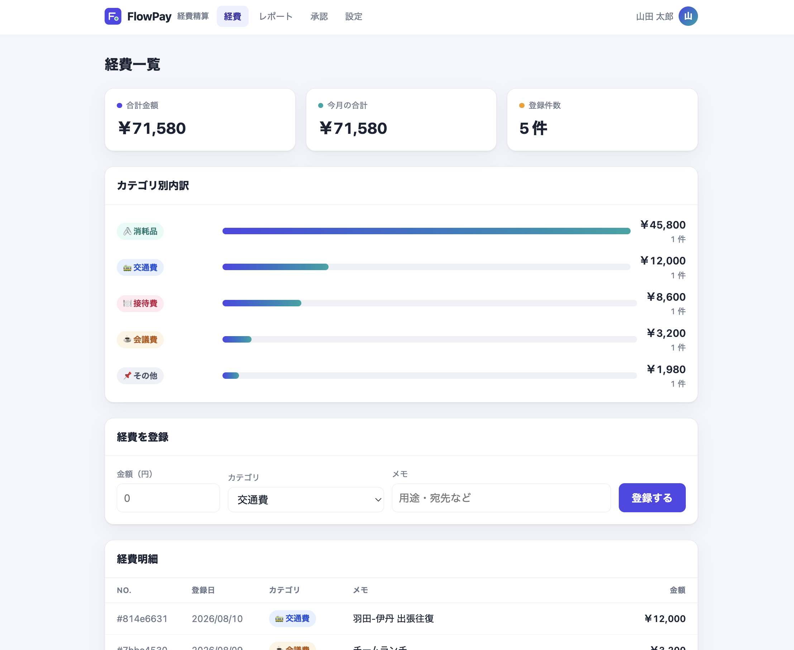
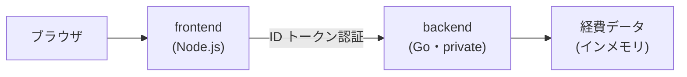
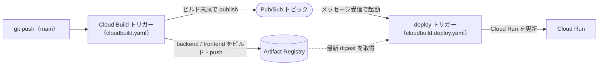
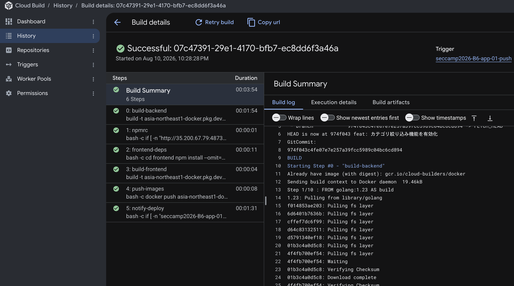
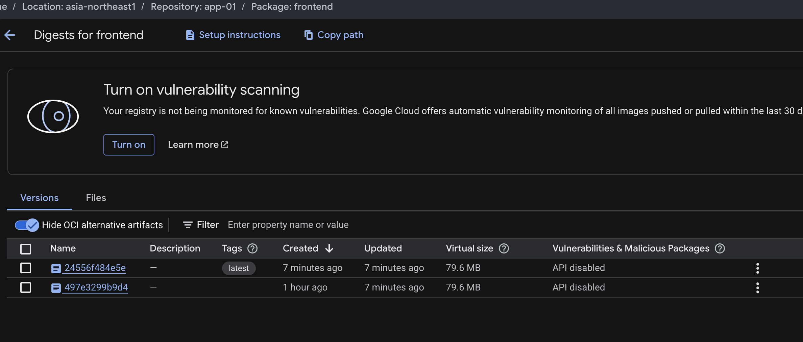
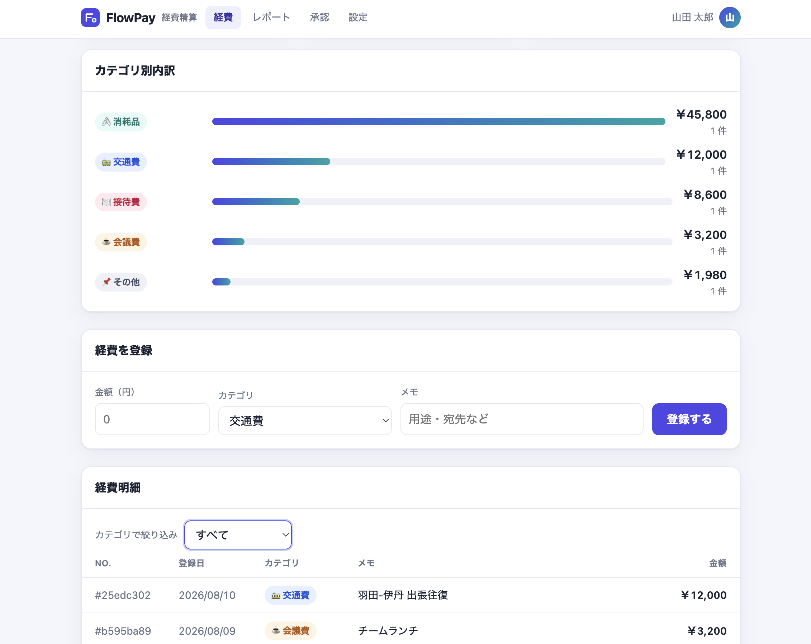

# 演習環境の確認

- [演習環境の確認](#演習環境の確認)
  - [1. サービスへの接続確認](#1-サービスへの接続確認)
  - [2. コード変更による CI/CD の実行確認](#2-コード変更による-cicd-の実行確認)
    - [2-1. パイプラインの全体像](#2-1-パイプラインの全体像)
    - [2-2. カテゴリ絞り込み機能の有効化](#2-2-カテゴリ絞り込み機能の有効化)
    - [2-3. 変更の push と CI/CD パイプラインの起動](#2-3-変更の-push-と-cicd-パイプラインの起動)
    - [2-4. ビルド実行状況の確認](#2-4-ビルド実行状況の確認)
    - [2-5. Artifact Registry への push 確認](#2-5-artifact-registry-への-push-確認)
    - [2-6. デプロイ結果の確認](#2-6-デプロイ結果の確認)

演習を始める前に、担当する FlowPay 環境が正常に稼働していること、および参加者自身のコード変更が CI/CD パイプラインを通じてデプロイされることを確認します。確認は以下の2段階で行います。

1. **サービスへの接続確認** — 稼働中の FlowPay にアクセスし、基本構成と表示内容を確認する。
2. **コード変更による CI/CD の実行確認** — 実際にコードを変更して push し、ビルド・デプロイが自動実行され、変更が反映されることを確認する。

いずれの操作も、参加者ごとに割り当てられた個別リポジトリと Google Cloud 環境に対して実施します。コマンド中の `app-<NN>` の `<NN>` は、各参加者に割り当てられた環境番号（例: `01`）に読み替えてください（環境は `app-01`、`app-02` … のように連番で割り当てられます）。FlowPay の実装コードの全体構成は [../src/README.md](../src/README.md) を参照してください。

---

## 1. サービスへの接続確認

フロントエンド・バックエンドともに、外部インターネットへ直接公開されない非公開（private）設定の Cloud Run 上で稼働しています。ローカル環境から動作を確認する際は、`gcloud run services proxy` コマンドでプロキシを経由して接続します。

```bash
gcloud run services proxy app-<NN>-frontend --region asia-northeast1 --port 8080
# 起動したまま、別のブラウザタブ等で http://localhost:8080 を開く
```



ブラウザで以下を確認します。

- 画面上部に「FlowPay 経費精算」のヘッダーが表示されること。
- 「経費一覧」に明細が表示され、合計金額などの経費サマリが正常に表示されること。
- 「カテゴリ別内訳」に、カテゴリごとの合計金額が表示されること。

経費サマリはフロントエンドが ID トークン認証でバックエンド（private）を呼び出して取得しています。サマリが表示されれば、フロントエンド単体だけでなく `frontend → backend` 間のサービス間通信も正常であることを意味します。



---

## 2. コード変更による CI/CD の実行確認

FlowPay は、GitHub リポジトリへの push を契機に Cloud Build がイメージをビルドし、Artifact Registry を経由して Cloud Run へデプロイされる構成です。ここでは軽微なコード変更を通じて、この一連のパイプラインが実際に動作することを確認します。

### 2-1. パイプラインの全体像



参加者用リポジトリでは、`main` ブランチへの push で `cloudbuild.yaml` が、Pull Request で `cloudbuild.pr.yaml`（PR チェック）が実行されます。この構成やパイプライン定義そのものが、第3章の演習で堅牢化していく対象となります。

### 2-2. カテゴリ絞り込み機能の有効化

初期状態のフロントエンドには、実装済みでありながら無効化（コメントアウト）されている「カテゴリ絞り込み」機能が存在します。これを有効化するコード変更を行い、変更がデプロイに反映される挙動を確認します。

`frontend/public/index.html` を開き、「経費明細」パネル内の絞り込み UI を有効化します。該当箇所は次のようにコメントアウトされています。

```html
      <!-- 環境確認の演習: 直後のブロックを囲んでいる HTML コメント（開始行と終了行）を削除すると、カテゴリ絞り込みが有効になります。 -->
      <!--
      <div class="filter">
        <label for="filter-category">カテゴリで絞り込み</label>
        <select id="filter-category" onchange="load()">
          <option value="">すべて</option>
          <option>交通費</option>
          <option>会議費</option>
          <option>消耗品</option>
          <option>出張費</option>
          <option>接待費</option>
          <option>その他</option>
        </select>
      </div>
      -->
```

`<div class="filter">` の直前にある `<!--` の行と、`</div>` の直後にある `-->` の行の 2 行を削除すると有効化されます（1 行目の説明用コメント `<!-- 環境確認の演習… -->` は残して構いません）。

有効化すると、一覧の上部にカテゴリ選択のプルダウンが表示され、選択したカテゴリで `GET /api/expenses?category=...` を呼び出して明細を絞り込めるようになります。呼び出し側のスクリプト（`load()`）およびバックエンド・中継 API（`server.js`）は本絞り込みに既に対応しているため、有効化に必要な変更はこの UI のコメント解除のみです。変更は frontend のみで完結します。

> [!TIP]
> この段階では依存関係やビルド設定（`package.json` / `Dockerfile` / `cloudbuild.yaml`）は変更しないでください。ビルドの成否原因を切り分けやすくするためです。

### 2-3. 変更の push と CI/CD パイプラインの起動

変更をコミットし、`main` ブランチへ push します。

```bash
git add frontend/public/index.html
git commit -m "feat: カテゴリ絞り込み機能を有効化"
git push origin main
```

push が完了すると、Cloud Build のトリガーが起動し、`cloudbuild.yaml` に定義されたビルドが自動的に開始されます。

### 2-4. ビルド実行状況の確認

Cloud Build のビルド履歴画面で、push を契機にビルドが起動していることを確認します。

- **Google Cloud コンソール**: Cloud Build → ビルド履歴（リージョン: `asia-northeast1`）を開き、直近のビルドが実行中または成功状態であることを確認します。各ステップ（`build-backend` / `frontend-deps` / `build-frontend` / `push-images`）のログを確認できます。
- **`gcloud` コマンドを利用する場合**:

  ```bash
  gcloud builds list --region asia-northeast1 --limit 5
  gcloud builds log <BUILD_ID> --region asia-northeast1
  ```



`frontend-deps` ステップでは、frontend の依存パッケージ `expense-format` を演習用 npm レジストリから取得します。ビルドログでは、このステップで依存関係が取得されている様子を確認できます。

### 2-5. Artifact Registry への push 確認

ビルドの `push-images` ステップで、新しいコンテナイメージが Artifact Registry のリポジトリ `app-<NN>` へ push されます。push された最新イメージ（`latest` タグ）の digest と時刻を確認します。



```bash
# frontend イメージを新しい順に表示（digest・タグ・更新時刻）
gcloud artifacts docker images list \
  asia-northeast1-docker.pkg.dev/$(gcloud config get-value project)/app-<NN>/frontend \
  --include-tags --sort-by=~UPDATE_TIME --limit=5
```

`latest` タグが今回のビルド時刻で更新され、新しい digest（`sha256:...`）が割り当てられていれば push は成功です。backend も `.../app-<NN>/backend` で同様に確認できます。Google Cloud コンソールの Artifact Registry（リポジトリ `app-<NN>`）からも、各イメージの push 時刻・digest・タグを一覧で確認できます。

### 2-6. デプロイ結果の確認

ビルドが成功すると、その末尾のステップが Pub/Sub トピックへ通知を publish します。この通知を契機に deploy トリガー（`cloudbuild.deploy.yaml`）が起動し、Artifact Registry 上の最新イメージを Cloud Run へ反映します。反映完了まで数分程度要する場合があります。

デプロイ完了後、再度プロキシを経由してアクセスし、「経費明細」の上部にカテゴリ選択のプルダウンが表示されていることを確認します。

```bash
gcloud run services proxy app-<NN>-frontend --region asia-northeast1 --port 8080
# ブラウザで http://localhost:8080 を再読み込みし、絞り込み UI の表示を確認する
```

プルダウンでカテゴリを選択し、明細が選択したカテゴリのみに絞り込まれれば成功です。無効化されていた機能を有効化し、「コード変更 → ビルド → デプロイ」という CI/CD の一連の自動化フローが正常に機能していることを確認できました。


