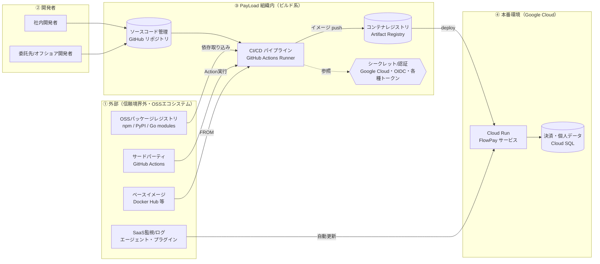

# 脅威モデリング演習

本演習では、攻撃者の視点に基づいてシステム全体の侵入経路および脅威を特定し、構造的・網羅的に分析・整理します。脅威モデリングの基本概念および各種フレームワークについては [README.md](./README.md) を参照してください。

## 対象システムと信頼境界

以下に PayLoad 社「FlowPay」の開発・ビルド・デプロイプロセスにおけるアーキテクチャを示します。システムの主要な構成要素、処理データフロー、および設定された信頼境界を図示しています。本演習の適用範囲に合わせて、Cloud Run および GitHub Actions を中心とした構成に整理・単純化しています。破線枠は信頼境界（Trust Boundary）を表します。

アーキテクチャ上で「暗黙の信頼」が存在する領域は以下のとおりです。

- **① → ③**: 外部の OSS パッケージ、サードパーティ製 GitHub Action、ベースイメージの完全性・正当性を前提としてシステム内に取り込みます。
- **② → ③**: 業務委託先を含む開発者アカウントの正当性、およびコミットされるコード内容を信頼します。
- **③（CI） → ④**: CI パイプライン上で構築されたビルド成果物を正規の成果物と見なして本番環境へデプロイします。
- **③（CI） ↔ SEC**: CI/CD パイプラインに対し、本番環境へのデプロイを実行可能な広範な権限および認証情報へのアクセスを許容します。

## 演習手順

1. システム構成図における信頼境界の跨ぎ（境界通過ポイント）を確認し、攻撃者の侵入経路（流入点）を特定します。あわせて、攻撃者が優先的に標的とする領域とその技術的理由について考察します。
2. 以下のワークシートを用いて脅威分析を実施します。各流入点において「信頼の前提」「想定される攻撃手法」「影響範囲（単一侵害時）」を抽出します。攻撃手法は、Shai-Hulud、tj-actions、TanStack などの実際のインシデント事例や SITF（SDLC Infrastructure Threat Framework）の攻撃テクニックを参照して具体化します。
3. 洗い出した流入点から1点を選定し、「対象の流入点 → 信頼の前提 → 攻撃手法 → 影響範囲 → 防御策」の順で構造化します。さらに、考案した防御策に対する回避手法や、防ぎ切れない残存リスクについても検討・考察します。

## 攻撃テクニックの一覧（SITF）

SITF（SDLC Infrastructure Threat Framework）は、開発から本番稼働に至るインフラ環境を 5つのレイヤーに区分し、各種攻撃を ID、ステージ、手法、リスク要因、対応策として整理した脅威フレームワークです。以下に代表的な攻撃手法およびリスク要因を示します。

実際のサイバー攻撃は単一のレイヤーで完結せず、初期侵入から複数レイヤーを段階的に横断して本番環境へと到達します。各手法がシステム構成図のどの要素に対応し、どのように被害が拡大するかを考慮して検証を行います。

**端末・IDE（T-E）**: 開発者の端末 PC、エディタ、拡張機能、連携アプリケーション。最上流工程に位置するため、この領域が侵害された場合、後続の全工程へ影響が波及します。

- **端末での悪性コード実行（T-E001）**: 開発者端末上で不正スクリプト等を実行させ、保存されている認証情報やアクセス資格情報を窃取する手法。
- **拡張機能の自動更新悪用（T-E015）**: 侵害したパブリッシャーアカウントから IDE 拡張機能の悪性アップデートを配信し、自動更新機能を介して全ユーザーへ配布する手法。バージョン未固定や自動更新の検証欠如がリスク要因となります。
- **OAuth トークンの悪用（T-E019）**: 窃取した OAuth トークンを用いて組織境界を突破し、SSO や MFA による保護を迂回する手法。過剰な権限スコープ付与や IP アドレス制限の欠如がリスク要因となります。

**VCS（T-V）**: ソースコード管理リポジトリ。取り込むソースコードの正当性の起点となります。

- **Imposter Commits（T-V002）**: 他の開発者になりすましてコミットを作成・追加する手法。コミット署名の未検証や認証プロセスの欠如により発生します。
- **タグ・参照の改ざん（T-V011）**: Git タグを強制 push（`force push`）して悪意のあるコミットを指すよう書き換え、可変タグを参照する利用側にバックドア入りのコードを取り込ませる手法（tj-actions の事例）。
- **フォーク間オブジェクト参照の悪用（T-V012）**: フォークリポジトリに配置した悪性コミットを、コミット SHA 経由でアップストリームリポジトリから参照可能にして取り込ませる手法。

**CI/CD（T-C）**: 成果物のビルドを実行し、本番デプロイ権限が集中するパイプラインの中枢領域です。

- **Pwn Request / PPE（T-C003）**: 未検証の Pull Request（特に外部フォーク由来）を契機として特権ワークフローを起動させ、任意コードを実行させる手法（TanStack の事例）。サービスアカウントのトークンやシークレットの漏洩につながります。
- **認証情報の不法使用（T-C001）**: 窃取した認証情報を悪用して CI/CD 基盤自体へ不正侵入する手法。MFA 未適用や過剰なアクセス権限の付与がリスク要因となります。
- **ワークフローからのシークレット抽出（T-C005）**: 実行中のパイプラインのワークフローログや環境変数を介して、暗号化シークレットを外部へ持ち出す手法。

**レジストリ（T-R）**: 依存パッケージやコンテナイメージの配布拠点。外部成果物を取り込む経路となります。

- **悪性パッケージの公開（T-R004）**: メンテナ権限やアクセストークンを奪取し、正規パッケージの悪性バージョンをパブリッシュする手法（axios、Shai-Hulud の事例）。
- **Typosquatting（T-R010）**: 正規パッケージ名に類似した名称の悪性パッケージを公開し、タイピングミス等による誤導入を誘導する手法。
- **Dependency Confusion（T-R011）**: 社内限定パッケージと同名かつ高バージョンの偽パッケージをパブリックレジストリへ配置し、優先的に取り込ませる手法。
- **インストールフックの悪用（T-R012）**: `postinstall` などのライフサイクルスクリプトを悪用し、パッケージ導入時に悪性コードを自動実行させる手法。

**本番・クラウド（T-P）**: 成果物が稼働する最終到達点であり、決済データや個人情報が集約される最重要領域です。

- **CI/CD 由来の本番認証情報の悪用（T-P001）**: CI/CD 環境内に保存された本番環境用認証情報を窃取し、本番基盤へ直接アクセス・操作する手法。
- **本番環境からのシークレット窃取（T-P011）**: 実行環境のメモリ空間やシークレット管理サービスから暗号鍵や資格情報を抽出する手法。
- **本番環境からのデータ持ち出し（T-P013）**: 侵害された実行環境から外部の C2 サーバー等へ機密データを直接送信する手法。

> 出典:
> - [SITF（SDLC Infrastructure Threat Framework）](https://wiz-sec-public.github.io/SITF/)
> - [SITF Technique Library](https://wiz-sec-public.github.io/SITF/techniques-library.html)
> - [SITF: The First Threat Framework for SDLC Infrastructure（Wiz Blog）](https://www.wiz.io/blog/sitf-sdlc-threat-framework)

## 参考: 優先順位設定の評価軸（一例）

特定された脅威をさらに絞り込む場合の一例として、以下の評価軸で影響度および発生可能性を見積もり、対応すべきセキュリティ対策の優先順位づけに用いることができます。本演習のワークシートは脅威と対策の対応づけを主眼とするため、優先順位づけの実施は任意です。

- **影響度**:
  - **低**: 一部機能の制限、非機密データの不整合
  - **中**: サービスの一時停止、一般ユーザーデータの漏洩
  - **高**: 長時間のサービス停止、全社的データ漏洩、決済情報・個人情報の漏洩に伴う法的・損害賠償責任の発生
- **発生可能性**:
  - **低**: 高度な攻撃技術や内部情報の事前入手が必須条件
  - **中**: 一般的な攻撃手法や自動化ツールで実行可能
  - **高**: 攻撃ツールが流通しており、極めて容易に実行・再現可能

PayLoad 社は決済データおよび個人情報を扱う Fintech 企業であるため、優先順位の策定においては、予算や開発効率に加えて、コンプライアンス要件およびサービスの継続性（可用性）の確保を最優先事項として考慮します。

## ワークシート

| 流入点 | 信頼の前提 | 想定される攻撃手法 | 影響範囲 | 防御策 |
| --- | --- | --- | --- | --- |
| 例）frontend の npm 依存パッケージの取り込み（① → ③） | 公開パッケージは安全である | メンテナ乗っ取りによる悪性バージョンの公開 | ビルド環境から本番環境まで（認証情報の窃取） | 依存パッケージの固定 |
| | | | | |
| | | | | |

## 補足: 流入点とインシデント・対策の対応関係

分析時の参考情報として、代表的な流入点、過去のインシデント事例、および対応する防御策の一覧を以下に示します。

| 流入点 | 実際のインシデント事例 | 主な防御策 |
| --- | --- | --- |
| OSS 依存の取り込み（① → CI） | Shai-Hulud、axios 侵害 | SCA/SBOM 解析、cooldown 運用の適用、`--ignore-scripts` の設定、検疫プロキシの導入 |
| サードパーティ Action（① → CI） | tj-actions/changed-files | コミット SHA による指定（pinning）、最小権限の付与、Ruleset の適用 |
| ベースイメージ（① → CI） | 悪性・汚染イメージの導入 | 署名済み distroless イメージの採用、イメージスキャン |
| 委託先・開発者アカウント（② → SCM） | axios（メンテナ乗っ取り）、XZ Utils | 多要素認証（MFA/Passkey）、ブランチ保護ルール、複数人レビューの必須化 |
| CI/CD ランナー（③ 内部） | Shai-Hulud 2.0、TanStack | OIDC 短命トークンの利用、ランナー環境の隔離・Egress 通信制限 |
| ビルド成果物のデプロイ（CI → ④） | TanStack（正当な provenance 付き悪性成果物） | cosign 署名および provenance の検証（Binary Authorization）。ただしビルド環境自体の侵害時には偽装されるリスクが存在 |
| SaaS 監視/ログの自動更新（① → ④） | Codecov、SolarWinds | 外部ツール自体のサプライチェーンリスク評価、Egress モニタリング |
| シークレットの参照（CI ↔ SEC） | 各種トークンの漏洩 | 長寿命鍵の廃止（Trusted Publishing/OIDC の採用）、スコープ限定シークレットの利用 |

**まとめ**: サプライチェーン攻撃は、システム内の信頼境界を跨ぐポイント（境界通過点）で発生します。したがって防御策においても、成果物の取得時、ビルド時、デプロイ時の各ポイントにおいて明示的な検証を行う多層防御の設計が不可欠となります。
