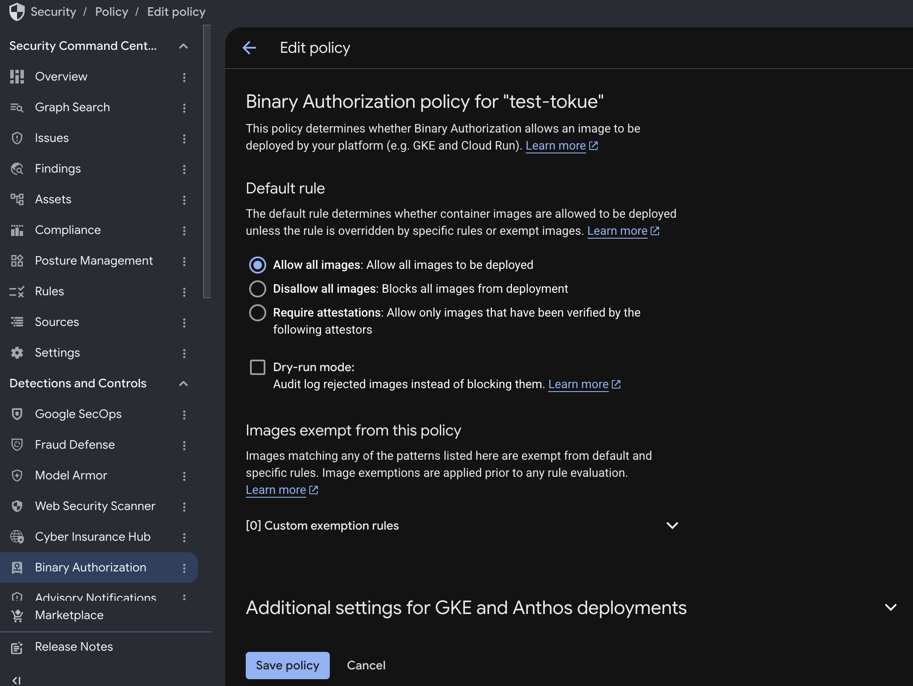

# 解答: provenance ＋ Binary Authorization によるデプロイ時検証

- [cloudbuild.yaml](./cloudbuild.yaml) — **provenance 生成有効化版**。`options` フィールドに `requestedVerifyOption: VERIFIED` を追加し、ビルド証明（provenance）の自動生成を有効化した構成です。
- [cloudbuild.deploy.yaml](./cloudbuild.deploy.yaml) — **デプロイ時検証組み込み版**。deploy パイプライン（`services update`）に `--binary-authorization=default` オプションを追加し、デプロイ時のポリシー検証を組み込んだ構成です。
- [binauthz-policy.yaml](./binauthz-policy.yaml) — **Binary Authorization ポリシー定義例**（`REQUIRE_ATTESTATION`）。
- [provenance-sample.json](./provenance-sample.json) — `--show-provenance` コマンドで取得した provenance の実例サンプル（**SLSA v0.1およびv1.0の両方**）。プロジェクト名・digest・コミット SHA・IP アドレス等はマスク処理済みであり、v0.1のビルド定義（recipe）および署名 envelope は省略しています。

事前準備: `export PROJECT=<your-google-cloud-project>`（`REGION` のデフォルト値は `asia-northeast1`）。

## 1. provenance 生成の有効化（ビルド側）
`pipelines/cloudbuild.yaml` の `options` フィールドに `requestedVerifyOption: VERIFIED` を追加します。本設定により Cloud Build が `built-by-cloud-build` アテスターを自動生成し、Artifact Registry へ push されたコンテナイメージに対して attestation（SLSA provenance）を自動付与します。

```yaml
options:
  logging: CLOUD_LOGGING_ONLY
  requestedVerifyOption: VERIFIED
```

## 2. deploy パイプラインでの検証有効化（本適用）
Binary Authorization は「サービス単位で検証を有効化（`--binary-authorization=default`）した Cloud Run サービスへのデプロイ」のみを検証対象とします。手動での `gcloud run deploy` 実行による単発検証のみでは、実運用環境の `app-<NN>` サービスは保護されません。**deploy パイプライン（`pipelines/cloudbuild.deploy.yaml`）内の `gcloud run services update` コマンドに `--binary-authorization=default` オプションを追加**し、実サービスへのデプロイ時に常時検証が実行される状態を設定します。

```yaml
# deploy-backend / deploy-frontend ステップの services update コマンドへ付与
gcloud run services update ${_SERVICE_BACKEND} --image="$${IMG}@$${DIGEST}" \
  --region=${_REGION} --binary-authorization=default --quiet
```

上記手順1および2の変更をコミットして push すると、ビルド（provenance 自動付与）→ deploy トリガーが順次実行され、`app-<NN>` サービスが「Binary Authorization 検証有効・attestation 付与済みイメージ」の構成で更新されます。

## 3. アテスターおよび attestation の確認
```bash
gcloud container binauthz attestors list --project $PROJECT   # built-by-cloud-build の存在確認
gcloud artifacts docker images describe \
  $REGION-docker.pkg.dev/$PROJECT/<リポジトリ>/backend:latest --show-provenance --format=json
```
`--show-provenance` オプションは **SLSA v0.1およびv1.0の両バージョン**の証明情報を返却します（Cloud Build は両フォーマットを自動生成・保存します）。課題3では v1.0の主要フィールド（`buildDefinition.externalParameters.buildConfigSource` / `resolvedDependencies` / `runDetails` / `subject` 等）について解説を行っています。取得可能な provenance の実例（両バージョン・マスク処理済み）は [provenance-sample.json](./provenance-sample.json) を参照してください。

## 4. 検証済みイメージのみデプロイを許可する設定

Google Cloud プロジェクトの Binary Authorization ポリシーを `REQUIRE_ATTESTATION` に設定し、`built-by-cloud-build` の attestation を保持するイメージのみデプロイを許可し、それ以外の未検証イメージを自動拒否する制御を有効化します。

本演習において設定バックアップの取得は必須ではありませんが、既存のポリシー設定を確実に復元したい場合は、事前にエクスポートを実行しておきます。

```bash
gcloud container binauthz policy export --project $PROJECT > /tmp/binauthz-backup.yaml   # 任意（復元用バックアップ）
sed "s/<PROJECT>/$PROJECT/" solutions/05-provenance-binauthz/binauthz-policy.yaml > /tmp/binauthz-require.yaml
gcloud container binauthz policy import /tmp/binauthz-require.yaml --project $PROJECT
```



## 5. 動作検証（allow: 実パイプライン / deny: 未検証イメージの手動デプロイ）
- **allow（実パイプラインでの正常系）**: 任意のコミットを push すると、build（attestation 付与）→ deploy トリガーが起動し `app-<NN>` サービスが更新されます。`REQUIRE_ATTESTATION` ポリシー適用下であっても、正当な attestation が付与されたイメージであるためデプロイは**成功**します（＝実際の CI/CD パイプラインが最小限の改修で検証付きデプロイ構成へ強化されます）。
- **deny（手動デプロイによる異常系・拒否動作の確認）**: パイプラインからは常に Cloud Build 製イメージのみが供給されるため、ポリシーによる拒否挙動は**未検証のコンテナイメージを手動デプロイ**することで確認します。

  ```bash
  gcloud run deploy binauthz-blocked-test --image=nginx \
    --binary-authorization=default --no-allow-unauthenticated \
    --region=$REGION --project $PROJECT
  # → ERROR: Container image 'nginx@sha256:...' is not authorized by policy.
  #   denied by attestor .../built-by-cloud-build:
  #   No attestations found that were valid and signed by a key trusted by the attestor
  ```

## 6. 【重要】検証の解除と設定の復元（共有環境への影響防止）
Binary Authorization ポリシーは Google Cloud プロジェクト単位のシングルトン設定であり全参加者で共有されるため、動作検証の完了後は `ALWAYS_ALLOW` 設定へ復元します。

```bash
cat > /tmp/binauthz-allow.yaml <<'EOF'
defaultAdmissionRule:
  evaluationMode: ALWAYS_ALLOW
  enforcementMode: ENFORCED_BLOCK_AND_AUDIT_LOG
globalPolicyEvaluationMode: ENABLE
EOF
gcloud container binauthz policy import /tmp/binauthz-allow.yaml --project $PROJECT
echo "policy now: $(gcloud container binauthz policy export --project $PROJECT --format='value(defaultAdmissionRule.evaluationMode)')"

# 後片付け: 検証用サービスの削除。演習環境を baseline の状態へ戻す場合は app-<NN> の binauthz 有効化設定も解除する
gcloud run services delete binauthz-blocked-test --region=$REGION --project $PROJECT --quiet 2>/dev/null || true
# gcloud run services update app-<NN>-backend  --region=$REGION --clear-binary-authorization --quiet
# gcloud run services update app-<NN>-frontend --region=$REGION --clear-binary-authorization --quiet
```

> 手順4においてバックアップファイル（`/tmp/binauthz-backup.yaml`）を取得しており、変更前のポリシー内容を厳密に復元したい場合は `gcloud container binauthz policy import /tmp/binauthz-backup.yaml` を実行します。ただし etag の競合等により設定変更が正しく反映されない場合があるため、確実性の観点からは上記の `ALWAYS_ALLOW` 明示設定コマンドの実行を推奨します。

## 議論ポイント（本編と接続）
- 本構成は「**事前に検証・署名された信頼できるビルド成果物のみがデプロイ可能である**」状態を継続的に維持・担保するセキュリティメカニズムです。
- ただし **TanStack** のインシデント事例が示した通り、**ビルド環境そのものが侵害された場合、正当な provenance が付与された悪性コンテナイメージが生成されるリスクが存在します**。したがって「デプロイ時の検証」のみでは防御策として不十分であり、**ソースコードの保護・ビルド用 SA の権限最小化・コンテナイメージの digest 固定（演習02・演習04）** などの各種対策を組み合わせた多層防御（Defense in Depth）アプローチが不可欠です。
- 「署名や provenance が付与されていれば絶対的に安全である」という過信を排し、「**明示的に検証を実施した上で信頼する。ただし単一の対策のみですべてのリスクを防ぎ切ることは不可能である**」という多層防御の観点に立ってセキュリティ対策を講じることが重要です。
