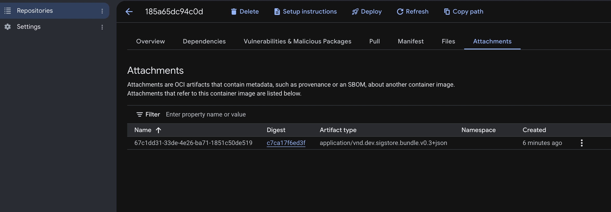

# 解答: cosign keyless 署名

- [cloudbuild.cosign.yaml](./cloudbuild.cosign.yaml) — Cloud Build 上で cosign keyless 署名を実行するパイプライン定義例
- [cloudbuild.verify.yaml](./cloudbuild.verify.yaml) — 署名検証を実行するパイプライン定義例

## 実行手順
`chapter3/exercises` ディレクトリから実行します。

```bash
# 事前準備: export PROJECT=<your-google-cloud-project>
SA=flowpay-build-sa@$PROJECT.iam.gserviceaccount.com

# 事前準備: SA に対して自分自身へのトークン作成権限（roles/iam.serviceAccountTokenCreator）を付与
gcloud iam service-accounts add-iam-policy-binding $SA \
  --member="serviceAccount:$SA" --role=roles/iam.serviceAccountTokenCreator --project $PROJECT

# 署名の実行（専用 SA を指定してビルドを実行）
# ※ ユーザー定義 SA を使うため --default-buckets-behavior=regional-user-owned-bucket が必要
gcloud builds submit --no-source --config solutions/06-cosign-keyless/cloudbuild.cosign.yaml \
  --service-account=projects/$PROJECT/serviceAccounts/$SA \
  --default-buckets-behavior=regional-user-owned-bucket --project $PROJECT

# 署名の検証
gcloud builds submit --no-source --config solutions/06-cosign-keyless/cloudbuild.verify.yaml --project $PROJECT
```

## 作成した署名の確認

cosign（v2）は生成した署名を **Artifact Registry の OCI referrer（添付アーティファクト）** として、対象イメージと同一のリポジトリ内に格納します（イメージ本体とは異なる digest を保持する manifest です。従来のタグ指定方式では `sha256-<イメージdigest>.sig` タグ形式でした）。作成した署名は以下の方法で確認できます。

署名の確認には2つの観点が存在します。**署名が付与されているか（存在の確認）** と、**その署名が正当であるか（有効性の検証）** です。gcloud コマンドおよび Google Cloud コンソール（Attachments タブ）は前者（署名アーティファクトの存在確認）を提供し、`cosign verify` コマンドは後者（署名者の identity・Rekor へのログ記録・Fulcio 証明書チェーンの暗号的検証）を実行します。デプロイ可否などの信頼判断には `cosign verify` を使用します。

### cosign による確認（tree による構造表示・verify による検証）

ローカル環境で実行する場合、cosign は Artifact Registry（AR）から署名およびイメージを取得するため、事前に AR への Docker 認証設定を行います。

```bash
gcloud auth configure-docker $REGION-docker.pkg.dev   # cosign が使用する docker 認証ヘルパーを登録

IMG=$REGION-docker.pkg.dev/$PROJECT/app-<NN>/backend
DIGEST=$(gcloud artifacts docker images list $IMG --include-tags --filter='tags:latest' --format='value(version)')

# 付与された署名・添付物をツリー形式で表示（署名 referrer の digest を確認可能）
cosign tree $IMG@$DIGEST
# 出力例:
# 📦 ... backend@sha256:<イメージdigest>
# └── 🔗 https://sigstore.dev/cosign/sign/v1 artifacts via OCI referrer: ...backend@sha256:<署名digest>

# 署名の正当性を検証（署名者主体＝ビルド用 SA、issuer＝Google）。cloudbuild.verify.yaml と同等の検証
cosign verify --certificate-identity=flowpay-build-sa@$PROJECT.iam.gserviceaccount.com \
  --certificate-oidc-issuer=https://accounts.google.com $IMG@$DIGEST
```

### gcloud コマンドによる確認

`gcloud artifacts attachments` コマンド（Artifact Registry の Attachments を操作する専用コマンド）を使用することで、コンテナイメージに紐づく署名・provenance・SBOM の一覧を取得できます。

```bash
# リポジトリ内の添付一覧（署名・provenance 等）を表示
gcloud artifacts attachments list \
  --project=$PROJECT --location=$REGION --repository=app-<NN> \
  --format='table(name.basename(), type, target.basename())'
#   → cosign 署名は type=application/vnd.dev.sigstore.bundle.v0.3+json として表示され、
#     target に署名対象イメージの digest が表示される
#     （provenance は type=application/vnd.in-toto.provenance+dsse）

# cosign 署名のみにフィルタリングし、詳細情報（annotations・files 等）を表示
gcloud artifacts attachments list \
  --project=$PROJECT --location=$REGION --repository=app-<NN> \
  --filter='type=application/vnd.dev.sigstore.bundle.v0.3+json'
```

### Google Cloud コンソール（Artifact Registry）による確認

Google Cloud コンソール → **Artifact Registry** → リポジトリ `app-<NN>` → `backend` → 対象イメージ（`:latest`）を選択し、**「Attachments（添付）」タブ**を開きます。cosign 署名は、対象イメージを参照する OCI アーティファクトとして以下のように一覧表示されます。



- **Artifact type**: `application/vnd.dev.sigstore.bundle.v0.3+json`（Sigstore バンドル＝cosign 署名）
- **Digest**: `cosign tree` コマンドで表示された署名 referrer の digest と一致

Attachments タブは、署名のほか provenance や SBOM など、コンテナイメージに紐づくメタデータ（OCI referrer）を横断的に確認できる管理画面です。「どの digest のイメージに対して、どのような種類の添付データ（署名 / provenance / SBOM）が、いつ付与されたか」を一覧で把握できます。

### 公開型の透明性ログ（Rekor）による確認

発行された署名は公開型の Rekor ログへ記録されます。<https://search.sigstore.dev/> にて、署名を実行したメールアドレス（ビルド用 SA）や対象イメージの digest を指定して検索・閲覧が可能です（Rekor の性質・注意点は [演習06](../../06-cosign-keyless.md) の NOTE を参照）。
